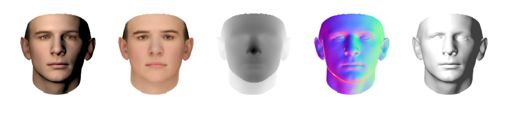
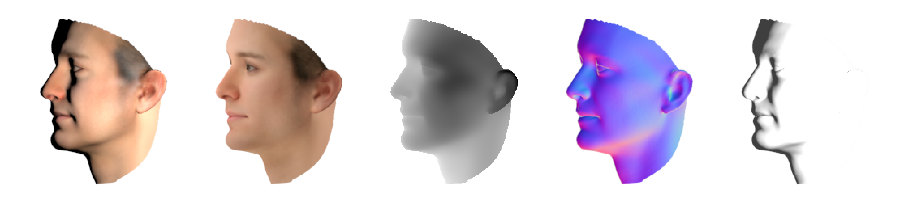
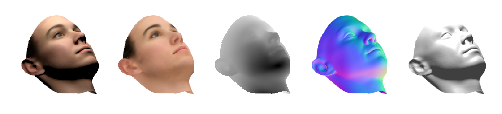

# Face Intrinsic Images

## Examples
Renders a face along with its reflectance, depth, surface normals, shading. 

   
   
  

## Instructions
1. `./setup.sh` to download the principle components from the [3D Face Morphable Model](https://www-inst.eecs.berkeley.edu/~cs194-26/fa14/Papers/BlanzVetter99.pdf).

2. Generate a numpy array with face identities and render parameters of the form:

`
[ [identity, filename, savepath, orientation, position], ... ]
`

where `identity` is a 400-length list of Morphable Model coefficients, `orientation` is given as a list of degrees `[rot_x, rot_y, rot_z]`, and `position` is a list of coordinates `[x, y, z]`. There is an example in `make_array.py`.

3. `./run.sh` to call `render.py` from Blender's Python. You'll need to point to your Blender folder and possibly a folder with Python3 scipy (if your Blender Python does not have it). You can modify the lighting parameters and the subset of the array that is rendered for parallel jobs. 
